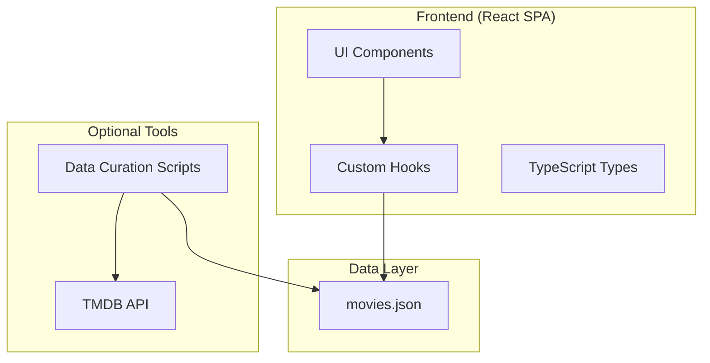
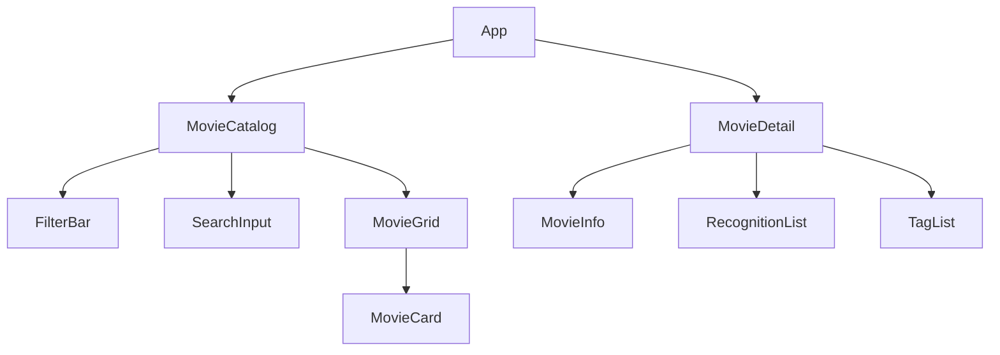

# Design Document: Art-House Movie Recommendations MVP

## Overview

This design describes a minimal viable product for an art-house movie recommendation website. The architecture prioritizes simplicity: a React/TypeScript single-page application that loads curated movie data from a static JSON file. The design keeps React Native compatibility in mind for future mobile development by separating data/logic from UI components.

The MVP avoids backend complexity by using static data that can be manually curated or generated with optional helper scripts.

## Architecture



### Key Design Decisions

1. **Static JSON Data**: Movie catalog stored as a JSON file bundled with the app. No backend server required for MVP.

2. **React + TypeScript**: Type-safe frontend with clear interfaces for movie data.

3. **Separation of Concerns**: Data fetching logic in custom hooks, keeping components focused on presentation. This enables future React Native reuse.

4. **Client-Side Filtering**: All filtering and search happens in the browser since the dataset is small (< 500 movies expected).

5. **Optional Data Scripts**: Node.js scripts that can fetch movie metadata from TMDB API to assist with manual curation.

## Components and Interfaces

### Component Hierarchy



### Core Components

**App**: Root component with routing between catalog and detail views.

**MovieCatalog**: Main page displaying the movie grid with filter and search controls.
- Props: none (uses hooks for data)
- State: activeFilters, searchQuery

**MovieCard**: Displays a single movie in the grid.
- Props: movie: Movie
- Renders: poster, title, director, year

**MovieDetail**: Full movie information page.
- Props: movieId: string (from route params)
- Renders: all movie metadata, recognitions, tags

**FilterBar**: Recognition filter controls.
- Props: availableFilters: string[], activeFilters: string[], onFilterChange: (filters: string[]) => void

**SearchInput**: Text search input.
- Props: value: string, onChange: (query: string) => void

### Custom Hooks

**useMovies**: Loads and provides access to the movie catalog.
```typescript
function useMovies(): {
  movies: Movie[];
  isLoading: boolean;
  error: Error | null;
}
```

**useFilteredMovies**: Applies filters and search to the movie list.
```typescript
function useFilteredMovies(
  movies: Movie[],
  filters: string[],
  searchQuery: string
): Movie[]
```

**useMovie**: Gets a single movie by ID.
```typescript
function useMovie(id: string): {
  movie: Movie | null;
  isLoading: boolean;
  error: Error | null;
}
```

## Data Models

### Movie Record Schema

```typescript
interface Movie {
  id: string;                    // Unique identifier (e.g., "parasite-2019")
  title: string;                 // Movie title
  director: string;              // Director name
  year: number;                  // Release year
  synopsis?: string;             // Plot summary
  posterUrl?: string;            // URL to poster image
  country?: string;              // Country of origin
  runtime?: number;              // Runtime in minutes
  cast?: string[];               // Main cast members
  genres?: string[];             // Genre classifications
  recognitions: Recognition[];   // Awards and selections
  tags?: string[];               // Thematic labels (e.g., "slow cinema", "existential")
}

interface Recognition {
  type: string;                  // e.g., "Cannes Palme d'Or", "Cahiers du Cinéma Top 10"
  year: number;                  // Year of recognition
  details?: string;              // Additional info (e.g., "Winner", "Nominee")
}
```

### Movie Catalog JSON Structure

```json
{
  "movies": [
    {
      "id": "parasite-2019",
      "title": "Parasite",
      "director": "Bong Joon-ho",
      "year": 2019,
      "synopsis": "Greed and class discrimination threaten...",
      "posterUrl": "https://image.tmdb.org/...",
      "country": "South Korea",
      "runtime": 132,
      "cast": ["Song Kang-ho", "Lee Sun-kyun", "Cho Yeo-jeong"],
      "genres": ["Drama", "Thriller"],
      "recognitions": [
        { "type": "Cannes Palme d'Or", "year": 2019, "details": "Winner" }
      ],
      "tags": ["class struggle", "dark comedy", "social commentary"]
    }
  ],
  "recognitionTypes": [
    "Cannes Palme d'Or",
    "Cannes Grand Prix",
    "Cannes Best Director",
    "Cahiers du Cinéma Top 10"
  ]
}
```


## Correctness Properties

*A property is a characteristic or behavior that should hold true across all valid executions of a system—essentially, a formal statement about what the system should do. Properties serve as the bridge between human-readable specifications and machine-verifiable correctness guarantees.*

### Property 1: Movie Card Displays Required Information

*For any* movie in the catalog with title, director, and year fields, the rendered MovieCard component should contain all three pieces of information in its output.

**Validates: Requirements 1.2**

### Property 2: Movie Detail Displays Available Information

*For any* movie with recognitions, genres, or tags arrays, the MovieDetail component should render all items from each array that is present.

**Validates: Requirements 2.2, 2.3, 2.4**

### Property 3: Missing Fields Handled Gracefully

*For any* movie with missing optional fields (synopsis, posterUrl, country, runtime, cast, genres, tags), the MovieDetail component should render without throwing errors and should not display placeholder text for missing fields.

**Validates: Requirements 2.5**

### Property 4: Recognition Filter Correctness

*For any* movie catalog and selected recognition filter, every movie in the filtered results should have at least one recognition matching the filter type.

**Validates: Requirements 3.1**

### Property 5: Search Filter Correctness

*For any* movie catalog and search query, every movie in the filtered results should have a title or director name that contains the search query (case-insensitive).

**Validates: Requirements 4.1**

### Property 6: Filter Reset Shows All Movies

*For any* movie catalog, after applying and then clearing all filters and search queries, the displayed movie count should equal the total catalog count.

**Validates: Requirements 3.2, 4.2**

### Property 7: Movie Schema Validation

*For any* movie in the catalog JSON, the movie should have required fields (id, title, director, year), and if recognitions are present, each recognition should have type and year fields.

**Validates: Requirements 6.1, 6.3, 6.4**

## Error Handling

### Data Loading Errors

- If the movies.json file fails to load, display a user-friendly error message with a retry option
- Log errors to console for debugging

### Missing Data Handling

- Optional fields that are undefined or null should be omitted from display
- Poster images that fail to load should show a placeholder image
- Empty arrays (cast, genres, tags) should result in their sections being hidden

### Invalid Route Handling

- If a user navigates to a movie detail page with an invalid ID, display a "Movie not found" message
- Provide a link back to the catalog

### Search/Filter Edge Cases

- Empty search queries should be treated as "no filter"
- Whitespace-only search queries should be trimmed and treated as empty

## Testing Strategy

### Unit Tests

Unit tests should cover specific examples and edge cases:

- MovieCard renders correctly with minimal data (only required fields)
- MovieCard renders correctly with full data (all fields populated)
- MovieDetail handles missing optional fields
- FilterBar correctly toggles filter states
- SearchInput debounces input correctly
- Empty catalog displays appropriate message
- Invalid movie ID shows not found message

### Property-Based Tests

Property tests validate universal properties across generated inputs. Use a property-based testing library (e.g., fast-check for TypeScript).

Configuration:
- Minimum 100 iterations per property test
- Each test tagged with: **Feature: arthouse-movies, Property {number}: {property_text}**

Property tests to implement:
1. **Property 1**: Generate random movies, verify MovieCard output contains required fields
2. **Property 4**: Generate random catalogs and filters, verify filter correctness
3. **Property 5**: Generate random catalogs and search queries, verify search correctness
4. **Property 6**: Generate random catalogs, apply/clear filters, verify count equality
5. **Property 7**: Generate random movie objects, validate against schema

### Integration Tests

- Full page render of MovieCatalog with sample data
- Navigation from catalog to detail and back
- Filter and search interaction together

### Test Data

Create a test fixtures file with:
- Minimal valid movie (required fields only)
- Complete movie (all fields populated)
- Movies with various recognition types
- Edge case movies (empty arrays, missing optional fields)
